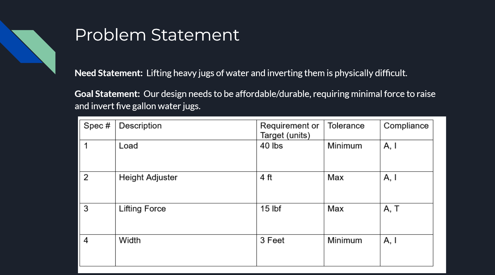

# Design Project #1

> Design project, including customer research, to meet strict design criteria.  

> Our goal was to make a device that would help people in rural Mexican communities transport, lift, and rotate 5 gallon water jugs. Our prototype only had to lift a 1 gallon jug, however, we chose to go full scale because our design was feasible. It succeeded at raising and rotating the jug, requiring minimal effort for a less able person to easily mount their water.
---
